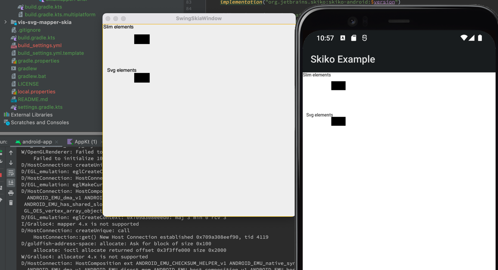

# lets-plot-skia-mapper

Rendering lets-plot with Skia. This project is a WIP.


### Local configuration for Lets-Plot project.
1. Add the following modules to publication process of the lets-plot project:  
 >'base',
 'mapper-core',
 'vis-svg-mapper',
 
Or use this patch:
```
Index: build.gradle
IDEA additional info:
Subsystem: com.intellij.openapi.diff.impl.patch.CharsetEP
<+>UTF-8
===================================================================
diff --git a/build.gradle b/build.gradle
--- a/build.gradle	(revision ab56885ce3bebd59d472789796db9819424d366c)
+++ b/build.gradle	(date 1653584877093)
@@ -180,6 +180,9 @@
 subprojects {
     // Configure publishing for projects which "Lets-Plot Kotlin API" depends on.
     if (name in [
+            'base',
+            'mapper-core',
+            'vis-svg-mapper',
             'plot-base-portable',
             'base-portable',
             'vis-svg-portable',

```
2. Run the following command:
> ./gradlew publishAllPublicationsToMavenLocalRepository

### Local configuration for Skia mapper project.
1. Add the following property `maven.repo.local=<LETS-PLOT-PROJECT-ROOT>/.maven-publish-dev-repo` to the `local.properties` file.
