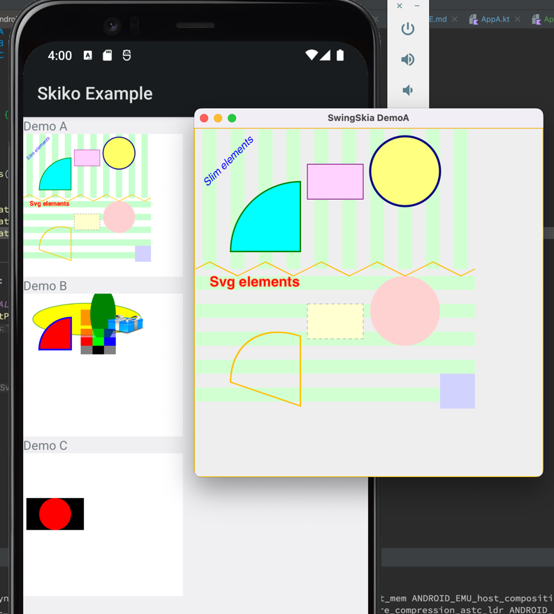

# lets-plot-skia-mapper

Rendering lets-plot with Skia. This project is a WIP.


### Local configuration for Lets-Plot project.
1. Add the following modules to publication process of the lets-plot project:  
 > 'base',
'mapper-core',
'vis-svg-mapper',
'plot-builder',
'vis-canvas',
'vis-swing-common',
'vis-swing-common-jvm',
'plot-config',
'vis-demo-common',
 
Or use this patch:
```
Index: build.gradle
IDEA additional info:
Subsystem: com.intellij.openapi.diff.impl.patch.CharsetEP
<+>UTF-8
===================================================================
diff --git a/build.gradle b/build.gradle
--- a/build.gradle	(revision 285615fc3b1716631fb2370f66227bd60986bf0a)
+++ b/build.gradle	(date 1657092743520)
@@ -180,6 +180,15 @@
 subprojects {
     // Configure publishing for projects which "Lets-Plot Kotlin API" depends on.
     if (name in [
+            'base',
+            'mapper-core',
+            'vis-svg-mapper',
+            'plot-builder',
+            'vis-canvas',
+            'vis-swing-common',
+            'vis-swing-common-jvm',
+            'plot-config',
+            'vis-demo-common',
             'plot-base-portable',
             'base-portable',
             'vis-svg-portable',
```
2. Change Kotlin version to `1.6.10` in `gradle.properties`
3. Run the following command:
> ./gradlew publishAllPublicationsToMavenLocalRepository

### Local configuration for Skia mapper project.
1. Add the following property `maven.repo.local=<LETS-PLOT-PROJECT-ROOT>/.maven-publish-dev-repo` to the `local.properties` file.
